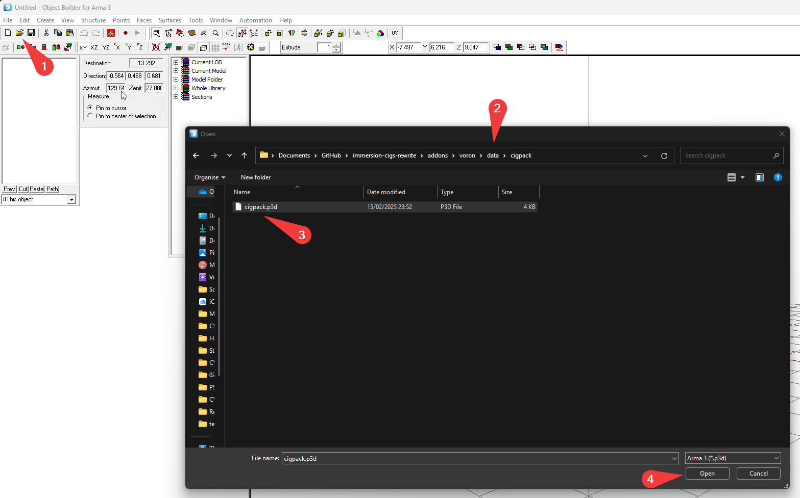
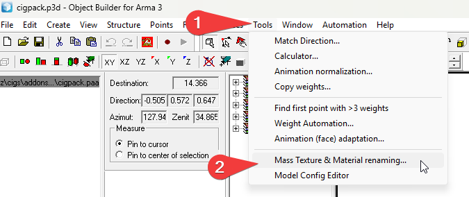
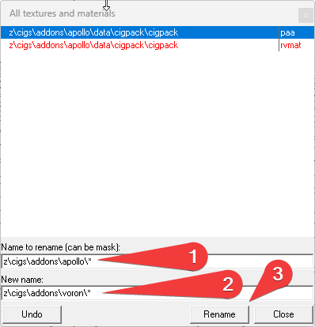

# How to adjust the texture paths inside the p3d's

## 1. Download Arma 3 Tools via Steam

## 2. Open Object Builder from Arma 3 Tools

## 3. For each of the p3d files inside the addon:
by default, its `cigpack.p3d`, `cig0.p3d`,`cig1.p3d`,`cig2.p3d`,`cig3.p3d` and `cig4.p3d`

### 3.1 Open p3d

### 3.2 Open `Tools / Mass Texture & Material Renaming`

### 3.3 Mass Rename the Paths

### 3.4 Save

### 3.5 Repeat